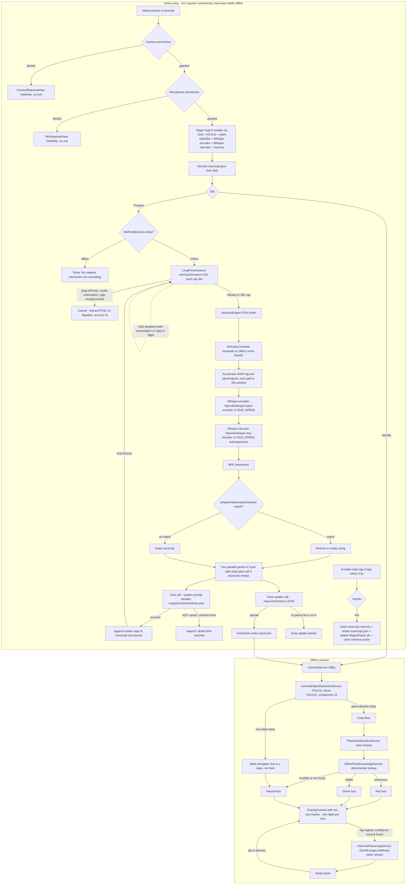

# Campy / ZeticMelangeVibe — PRD and Implementation Plan

Single-screen SwiftUI iOS app with two modes:

1. **Online prep (assistant mode)**: voice-first conversation. User press-and-holds the assistant body (≥0.5 s, hard-capped at 30 s to match Whisper's fixed window) to talk; raw mic audio is captured locally via `AVAudioEngine` while held; on release (or cap fire), the buffered audio is transcribed entirely on-device through a two-model Zetic pipeline — **Whisper encoder** (`OpenAI/whisper-base-encoder` v1, `ZeticMLangeModel`, `RUN_SPEED`) followed by **Whisper decoder** (`OpenAI/whisper-tiny-decoder` v1, `ZeticMLangeModel`, `RUN_SPEED`) running an autoregressive token loop — producing a final transcript that is then sent to `gemini-2.5-pro`. Each model reply follows a fixed three-part structure — **(a)** restate / summarize what the user said, **(b)** respond with relevant information, **(c)** ask one or two follow-up / clarifying questions — enforced by the chat-call system prompt; the same prompt also defines the canned empty-input and incoherent-input replies so the model emits them verbatim when applicable. There is no turn cap and no auto-termination. Replies render directly on the paper background (no card chrome), stacking downward, separated by a small left-aligned brand-logo divider asset (asset and exact size supplied by user). Only model replies are persisted in the transcript — the user's spoken text is never shown. The transcript is atomically persisted to `Application Support/transcript.json` after each reply and re-loaded on launch, so it survives backgrounding, force-quit, and offline use. An invisible triple-tap on the assistant body (3 taps within 0.5 s, no hold) opens a confirm-delete dialog (Yes / No) that wipes the transcript file, every region pack on disk, and the Gemma narrative cache. Alongside every visible reply, a parallel `responseSchema` Gemini call updates a region pack — destination-keyed list of plant species labeled `edible` / `inedible` / `poisonous` plus a textual prep blurb — saved locally and consumed by the offline identify pipeline. There is no manual generate-pack button.
2. **Offline identify (camera mode)**: real-time hybrid CV pipeline. **YOLO11** (`Steve/YOLO11_comparison` v5, hosted via Zetic `ZeticMLangeModel`, `modelMode: .RUN_ACCURACY`) detects every object per frame and draws a bounding box. Plant-class detections are cropped and run through the offline plant classifier (`NumaanFormoli/plant300k` v2, hosted via Zetic `ZeticMLangeModel`, `modelMode: .RUN_ACCURACY`) to predict a scientific name; a deterministic lookup against the region pack drives the live red / green / neutral box color. Non-plant detections short-circuit to a static "this is a {class}, not food" template. Tapping a box pauses inference, expands a full-screen detail sheet via a custom bloom animation, and shows a paragraph narrated by an on-device Gemma model (`changgeun/gemma-4-E2B-it` v1, hosted via Zetic `ZeticMLangeLLMModel`, `modelMode: .RUN_AUTO`) combining the species record with the pre-collected prep info. Tapping anywhere on the sheet dismisses it and resumes live inference.

Target device: **iPhone 15** (A16 Bionic, 16-core ANE).

## Implementation guidelines

- **Source of truth for Apple frameworks is the official Apple Developer Documentation.** During implementation, consult docs (via the `user-apple-docs` MCP) before writing non-trivial framework code. Don't rely on memory for API surfaces. Specifically expected references:
  - `AVFoundation` for `AVCaptureSession`, `AVCaptureVideoDataOutput`, `AVCaptureDevice`, sample-buffer handling, threading rules.
  - `AVFoundation` `AVAudioEngine` for the assistant-mode mic pipeline (raw PCM capture only — transcription is done by Whisper on-device, not by Apple's `Speech` framework).
  - `AVFoundation` `AVAudioConverter` to resample device-native float audio to 16 kHz mono float32 (Whisper input requirement) before mel-spectrogram preprocessing.
  - `CoreVideo` for `CVPixelBuffer` formats and pixel-buffer pool patterns.
  - `SwiftUI` for `@Observable`, `@Environment`, sheet/transition animations, safe-area insets (Dynamic Island handling), `Material.ultraThin` (assistant blur and tab bar frosted overlay), `matchedGeometryEffect` (detail-sheet bloom).
  - `UIKit`/`SwiftUI` interop for `UIViewRepresentable` (camera preview layer).
  - `Foundation` for `URLSession`, `JSONEncoder`/`JSONDecoder` with strict keys, `FileManager` (`.applicationSupportDirectory`).
  - `Network` for `NWPathMonitor` (network reachability check at hold-start in `AssistantView`).
  - `Accelerate`/`vDSP` for tensor preprocessing **and** Whisper log-mel spectrogram generation (STFT magnitude → 80-bin mel filterbank → log) on the captured PCM buffer prior to the encoder pass.
- Cite the doc URL in code comments only when the API has non-obvious constraints (e.g., `AVCaptureSession` start/stop must be on a background queue, `AVAudioConverter` resample policy with variable-rate sources).
- ZeticMLange-specific calls follow `https://docs.zetic.ai/` rather than Apple docs; Apple docs cover everything else.

## Locked architecture decisions

- **Shell**: Single SwiftUI root with state-driven mode switching (camera vs assistant). Camera and assistant modes are mutually exclusive: when the assistant is active, `AVCaptureSession` is paused and `AVAudioEngine` runs; when camera is active, the audio engine is torn down. They never run simultaneously, to avoid mic + camera resource contention.
- **Recognition**: two-stage hybrid pipeline. **One label per box, never two.** YOLO11 owns the bounding boxes; the plant classifier never runs against the full frame and never produces its own boxes. Wild plants outside YOLO11's class list are a known limitation (see risks).
  - **Stage 1 (every frame)**: YOLO11 (`Steve/YOLO11_comparison` v5, Zetic `ZeticMLangeModel`, `RUN_ACCURACY`) detects all visible objects and produces bounding boxes with class labels.
  - **Stage 2 (plant-class crops only)**: each YOLO box whose class is in the plant allowlist (default: `potted plant`; tunable in `ModelConfig`) is cropped and run through the offline plant classifier (`NumaanFormoli/plant300k` v2 via `ZeticMLangeModel`, `RUN_ACCURACY`). Returns top-1 scientific name + confidence.
  - **Verdict**: the live red / green / neutral / "not food" label comes from a deterministic lookup of the predicted scientific name in the active region pack (for plant boxes) or from the static template keyed off the YOLO class (for non-plant boxes). Gemma is not in the per-frame path. Each box renders a single label, never both.
  - **Non-plant detections**: short-circuit to a static "this is a {class}, not food" template keyed off the YOLO class. No species step, no LLM call.
  - **Runtime**: five Zetic-hosted on-device models total — `ZeticMLangeModel` for YOLO11, the plant classifier, the Whisper encoder (`OpenAI/whisper-base-encoder` v1, `RUN_SPEED`), and the Whisper decoder (`OpenAI/whisper-tiny-decoder` v1, `RUN_SPEED`); `ZeticMLangeLLMModel` for Gemma (`changgeun/gemma-4-E2B-it` v1, `RUN_AUTO`). All five are eager-loaded on the splash. Fallback paths exist for each (see risks).
- **Online prep**: iOS calls Gemini directly using `gemini-2.5-pro`. **Two parallel calls per user turn**, both seeded with the full conversation so far:
  - **Chat call** — free-text reply. The system prompt instructs the model verbatim: "If the input is empty, reply with exactly `I didn't quite get that, can you repeat`. Else if the input is incoherent / unintelligible, reply with exactly `I didn't quite understand that, can you repeat`. Else reply in three parts: (a) restate / summarize what the user said, (b) respond with relevant information, (c) ask one or two follow-up / clarifying questions." No `responseSchema`. The model's full text is rendered verbatim in the transcript — no client-side branching on empty / incoherent.
  - **Pack-update call** — fired in parallel using `responseSchema` + `responseMimeType: application/json`. Returns the latest best-effort full region pack given everything the conversation has surfaced so far. Result is written to disk via `PackStore`; the offline identify path always reads the freshest pack on the next frame. If parsing fails, retry once with the failure message appended; on second failure, drop this update silently and keep the previous pack on disk. **Skip the pack-update call entirely when the transcript is empty** — no destination context to extract.
  - **Quota / network failure**: if either call returns an HTTP 429, quota error, or unrecoverable network error, append a single canned reply `"Model limit reached"` to the transcript instead of the chat output, and silently drop the pack-update. Subsequent turns continue normally.
  - API key surfaced from `Secrets.xcconfig` -> Info.plist -> `SecretsLoader`; never committed.
  - Input is **voice**: a `LongPressGesture(minimumDuration: 0.5)` on the assistant body (everything above the tab bar) drives `SpeechInputService`, which captures raw mic PCM via `AVAudioEngine` and buffers it in memory while held. **Transcription is performed on-device after the hold ends** by the Whisper pipeline (`WhisperTranscriberService`, see below) — there is no live partial transcript in v1. Apple's `Speech` framework is not used; no cloud STT, no typed fallback. While held **and online**, the screen blurs (`.ultraThinMaterial`) and a centered audio-reactive `Circle` visualizes mic input level (smoothed RMS computed from the captured PCM). While held **and offline**, the same blur appears but the audio orb is replaced by a centered `"No network connection"` message; no audio is recorded and `SpeechInputService` is not started (Whisper itself runs offline, but the downstream Gemini call cannot, so we gate at hold-start). Network reachability is checked at hold-start via `NWPathMonitor`.
  - **Whisper pipeline**: on dispatch, the buffered PCM is resampled to 16 kHz mono float32 via `AVAudioConverter`, padded with zeros to exactly 30 s (Whisper's fixed input window; the 30 s hold cap guarantees we never need more than one window), converted to an 80-bin log-mel spectrogram via `Accelerate`/`vDSP`, run once through the Zetic-hosted `OpenAI/whisper-base-encoder` v1 in `RUN_SPEED` mode, then decoded autoregressively by `OpenAI/whisper-tiny-decoder` v1 (greedy argmax sampling, suppress timestamp tokens, stop on `<|endoftext|>` or a configurable `whisperMaxDecodeTokens` cap). The decoded token IDs are detokenized via the bundled Whisper BPE tokenizer (vocab + merges shipped in `Resources/Whisper/`) into a single UTF-8 string, then handed to `GeminiPackService`. Whisper hallucination on near-silence is filtered by a small client-side denylist (`whisperHallucinationDenylist` in `PromptConfig`, e.g. `"Thanks for watching!"`, `"♪"`, `"..."`); when matched, the transcript is rewritten to empty so the chat-call system prompt routes to its empty-input canned reply. **Whisper runtime failure** (encoder/decoder throws, OOM, malformed output) is caught at the `WhisperTranscriberService` boundary and surfaced as an empty transcript — the same path as the silence-denylist match, which causes Gemini's system prompt to emit `"I didn't quite get that, can you repeat"`. The user never sees a raw error.
  - **Hold lifecycle**: hold ≥0.5 s starts recording (online only). Drag-off cancels (touch leaves the assistant body's rect — defined as the safe-area body minus the tab-bar pill region; a drag onto the Dynamic Island, status bar, or tab-bar pill all cancel; once cancelled, no resume — user must lift and start a fresh hold; buffered PCM is discarded without invoking Whisper). Release dispatches: stop recording → run Whisper → fire the parallel Gemini calls. **Hard 30 s cap**: if the hold reaches 30 s, recording auto-finalizes (visually identical to release) and the same dispatch path runs. The cap exactly matches Whisper's input window so there is never any chunking, stitching, or seam handling. **Audio interruption** (incoming call, Siri, alarm) and **app backgrounding** mid-hold both behave identically to drag-off cancel — the buffer is discarded, the blur and visualizer dismiss, no Whisper run, no Gemini call, no error UI. `SpeechInputService` observes `AVAudioSession.interruptionNotification` and `AssistantView` observes `scenePhase != .active`; either signal triggers `cancel()`. The hold gesture is **disabled while a Whisper transcription or Gemini reply is in flight** — the assistant body ignores new long-presses from dispatch until the reply has been appended to the transcript. The visualizer fades on dispatch to indicate end-of-input; while Whisper is transcribing, the placeholder reply slot shows the existing pending shimmer.
  - Output is **text on screen** (no TTS read-back in v1), rendered directly on the paper background with no card chrome. Replies stack downward separated by a small left-aligned brand-logo divider; the slot scrolls. A new model reply only renders after **all three** of (1) the user releases the press (or the 30 s cap fires), (2) the Whisper pipeline finishes transcribing, and (3) the Gemini chat call returns.
  - **No turn cap, no question floor.** Conversation continues until the user stops speaking to the app; the system prompt is the sole driver of reply structure.
  - **Persistence**: the transcript is persisted to disk as `Application Support/transcript.json` via atomic `JSONEncoder` writes after every appended reply; it is decoded on app launch so prior conversations survive backgrounding and force-quit. Reinstalling the app clears the file (iOS removes the container). Renders identically online and offline; only mic input is gated on connectivity.
  - **Triple-tap to clear**: an invisible triple-tap (3 discrete taps within 0.5 s, no hold) on the assistant body presents a confirm dialog with Yes / No. Yes wipes the in-memory transcript, deletes `transcript.json`, deletes every region pack on disk under `Application Support/RegionPacks/`, and clears the Gemma narrative cache. No: dismiss. The triple-tap recognizer requires the long-press recognizer to fail first so a sustained hold cannot be misread as taps. There is no on-screen affordance — the gesture is intentionally an undocumented easter egg surfaced only in the demo presentation.
- **Pack contents per region**: one JSON per destination containing species records keyed by scientific name. Each record is categorized as exactly one of `edible`, `inedible`, or `poisonous`, and includes aliases / common names, risk rationale, and preparation / handling notes. Goal is best-effort exhaustive coverage for that region.
- **Offline decision rule** (live):
  - For each plant detection, classify to `scientific_name` with confidence.
  - Look it up in the active region JSON.
  - Found and `poisonous` → red box.
  - Found and `edible` → green box ("identified as: …", never "safe to eat").
  - Found and `inedible` → neutral box.
  - Not found → neutral box with "not in local database" sublabel.
- **Tap-to-info detail sheet**: when the user taps a box, `CameraService.pause()` is called and inference workers idle. The detail sheet animates open with a "bloom" expansion — a custom `matchedGeometryEffect` from the tapped box frame to a full-screen card, driven by a non-linear scale + opacity curve to approximate a genie-style reveal. The on-device Gemma model (`ZeticMLangeLLMModel`, `changgeun/gemma-4-E2B-it` v1, `RUN_AUTO`) is invoked once with `(scientific_name, region pack record, prep blurb)` (or `(yolo_class)` for non-plant), tokens are streamed via `model.waitForNextToken()` and appended to the sheet as they arrive. Final paragraphs are cached in memory keyed by scientific name / YOLO class so subsequent taps on the same species are instant. Gemma never affects live verdict color. Tapping anywhere on the open sheet dismisses it; on dismissal `CameraService.resume()` is called and inference returns to live.
- **Region input**: free-text via voice. The model is responsible for inferring the destination from anything the user says across the conversation — best-effort reasoning, no dedicated destination prompt. Rehearse with a specific destination ("Angeles National Forest") for the demo.
- **Labeling policy**: red / green / neutral. Green never says "safe to eat" — only "identified as: …". Red carries explicit hazard rationale.
- **Disclaimer**: a single fine-print line at the bottom safe-area edge of `ModelLoadingView` reading "Product in Beta testing, models could make mistakes. Use at your own risk." No modal, no acceptance gate, no persistent footer in camera or assistant modes. Copy avoids "exhaustive" / survival-grade framing.
- **Performance targets (iPhone 15 / A16)**: 30 fps preview, real-time YOLO11 detection with near-real-time plant classification on detected crops, <400 ms detection-to-label latency for primary detections, <2 s mode-switch, Gemma first-token <1.5 s and full paragraph <3 s on tap.
- **Persistence**: region JSON in `Application Support/RegionPacks/{slug}/`. Refreshed automatically by every parallel pack-update call; the directory is wiped only by the triple-tap "delete conversation" confirm flow. No 14-day TTL, no stale flag — the pack is a side-effect of conversation, not a standalone document.
- **Demo safety net**: bundle one pre-generated pack for the rehearsed destination so airplane-mode failure of online prep doesn't kill the demo.

## Locked defaults (small decisions, baked in)

- **Build target**: iPhone 15 only. `IPHONEOS_DEPLOYMENT_TARGET = 17.0`, `TARGETED_DEVICE_FAMILY = 1` (iPhone), portrait-only. Hardware assumptions: A16 Bionic with 16-core Neural Engine (~17 TOPS), 6 GB RAM, 6.1" Super Retina XDR (2556x1179), Dynamic Island, 48MP rear wide camera. We don't gate the App Store binary to one model, but we test, tune thresholds, and benchmark exclusively on iPhone 15.
- **Concurrency**: Swift Concurrency end-to-end (`async/await`, `actor`). No Combine.
- **Camera**: rear lens, 1920x1080 preset, 30 fps preview, `kCVPixelFormatType_32BGRA` sample format.
- **Audio session**: dedicated `AVAudioEngine` for raw PCM capture (no `Speech` framework involvement), instantiated only in assistant mode and torn down on mode exit. No simultaneous capture with the camera session.
- **Voice transcription**: fully on-device via the Zetic-hosted Whisper encoder + decoder. Press-and-hold target is the assistant page body (everything above the tab bar) with `LongPressGesture(minimumDuration: 0.5)`. The tab bar is excluded so tab switching stays instant. Hold ≥0.5 s to start raw-PCM capture; release (or 30 s cap fire) ends capture and runs the Whisper pipeline, which returns a single final transcript that drives the parallel Gemini calls. The 30 s cap is sized to match Whisper's fixed input window exactly — no chunking. Drag off the body cancels with no resume and discards the buffer without invoking Whisper. Permission strings: `NSMicrophoneUsageDescription` only — `NSSpeechRecognitionUsageDescription` is **not** required because Apple's `Speech` framework is not used. Mic permission is requested up-front on the splash; if denied the app is unusable (see permission flow above).
- **Inference threading**: capture queue dispatches frames to a dedicated `actor InferenceWorker`. If a previous frame is still in flight, drop the new one (no queueing, no head-of-line blocking).
- **Bounding boxes**: per-detection boxes are rendered on `OverlayCanvas`, colored from the deterministic verdict. Box itself is the tap target.
- **Box stability across frames**: `OverlayCanvas` keeps a per-detection `BoxTracker` keyed by stable IDs assigned via simple IoU matching (≥0.4 overlap with the previous frame's tracked box of the same class) so labels and tap targets don't strobe at 30 fps. Tracked boxes survive up to 5 missed frames before being dropped. Box position is interpolated toward the latest detection over a short spring animation to avoid pop.
- **Tap target conflict resolution**: when multiple boxes overlap at the tap location, the topmost candidate is the one with the **highest detection confidence in the current frame** (not the tracked box, not the largest area). Ties broken by smaller area.
- **Gemma cache**: in-memory `[String: GemmaNarrative]` keyed by scientific name (or YOLO class for non-plant). Lazily populated on first tap; not persisted to disk in v1.
- **Pack conflict rule**: each species appears under exactly one category; if a generation accidentally lists the same scientific name twice, `poisonous` beats `inedible` beats `edible`. Duplicates are dropped at parse time.
- **Pack overwrite**: keyed by destination slug (the model emits `destinationSlug` directly in the JSON; client also lowercases + ASCII-folds as a safety net). Each parallel pack-update overwrites the file on disk, last-write-wins.
- **Pack TTL**: none. Packs live until the user triple-tap-clears them or the app is reinstalled.
- **Permission flow** (all permissions are hard-required; both camera and microphone are needed to use the app):
  - **Welcome splash**: on app launch, `WelcomeView` displays for 3 seconds (paper background, centered "Welcome to Campy" wordmark) before any system prompts. After 3 s, the splash transitions to `ModelLoadingView` and triggers the permission sequence.
  - **Camera permission**: requested first, before model downloads start. On `.denied` / `.restricted`, the entire app body is replaced indefinitely by `CameraRequiredView` (a one-line "Camera access required" message). The app does not call `exit(0)`; the user must quit and relaunch after granting access in Settings. Identify cannot run without camera, and the assistant tab is also blocked since the app is camera-first.
  - **Microphone permission**: requested immediately after camera permission is granted, still on the loading splash, before model downloads complete. On `.denied` / `.restricted`, the entire app body is replaced indefinitely by `MicRequiredView` ("Microphone access required"). Same hard-deny semantics as camera — no `exit(0)`, no on-demand re-prompt. Permission is required up-front, not on first hold. **No `NSSpeechRecognitionUsageDescription` prompt** — Whisper runs as a generic Zetic model, not under Apple's speech-recognition entitlement.
- **Localization**: English-only for MVP; all copy in `UIStrings.swift` so localization is a future lift, not a refactor.
- **Color mode**: app forces light mode (`UIUserInterfaceStyle = Light` in Info.plist). Dark mode is out of scope for v1 and the palette is single-valued.
- **Brand palette** (locked, exhaustive — these four are the only brand colors):
  - Ink green: `#1F3D2B`
  - Leaf green: `#4F7C45`
  - Sage: `#A8BFA3`
  - Paper: `#F6F1E7`
- **Semantic safety token (outside the brand palette)**: `alertRed = #C0392B` lives in `UIConfig` as a dedicated safety color used **only** for the poisonous verdict box and detail-sheet rationale highlight. Deliberately not part of the brand palette.
- **Palette usage hierarchy**:
  - `paper` is the default app background and large surface color.
  - `inkGreen` is the primary text and high-contrast icon color.
  - `leafGreen` is the primary action color (buttons, active controls, positive state accents, edible verdict).
  - `sage` is the secondary surface/border/chip color for low-emphasis UI regions and the neutral verdict.
  - `alertRed` is reserved for the poisonous verdict and other safety-critical surfaces.
- **Dynamic Island**: do not draw `OverlayCanvas` content under the island region; reserve top safe-area inset accordingly (iPhone 15 has Dynamic Island, not a notch).
- **Detail sheet content**: scientific name + common name + Gemma narrative paragraph (token-streamed in via `ZeticMLangeLLMModel.waitForNextToken()`) + verbatim pack rationale. For `notFound` plant cases (no pack entry), the sheet shows the scientific name + a short "not in local database" line + the cautious not-found Gemma narrator output; pack rationale is omitted. For non-plant detections the sheet shows the static "this is a {class}, not food" line plus a small dismiss hint (no Gemma call). Tap anywhere on the sheet (including over text) to dismiss; the narrative area uses fixed-height layout so dismiss-tap and any future scrolling do not conflict.
- **Tab bar**: shared floating glass pill rendered by `TabBar.swift`. Sage fill (`#A8BFA3`) at 0.9 opacity, **shape = `Capsule()`** (always fully rounded; the Figma value `296` is treated as a hint that the pill should always be capsule-rounded — actual pixel/point dimension was likely a Figma artifact and is not honored as a literal corner radius). Frosted via a `Material.ultraThin` overlay, with the inset shadow seen in Figma. Two fixed tabs: `identify` (left, scan-search icon, "Identify") and `prepare` (right, checklist icon, "Prepare"). The selection-state pill animates between tabs on switch. Tab bar floats above the bottom safe area; it sits over the camera preview on `LiveView` and over the paper body on `AssistantView`.
- **Tab transition**: horizontal slide on tab change. `AppTab.identify` is the leftmost tab and `AppTab.prepare` is to its right; switching `identify → prepare` slides the new view in from the trailing edge while the old view slides out the leading edge, and vice versa.
- **Loading screen layout**: `ModelLoadingView` — paper background, app title (`UIStrings.appTitle`, currently "Campy") centered in the upper third, horizontal progress bar (266pt × 6pt track, ink-green dot fill, sage track at 20% alpha) horizontally centered near the vertical middle, "Powered by " text + `PoweredByZetic` image asset (transparent PNG) horizontally centered just below the progress bar, beta-disclaimer fine-print line at the bottom safe-area edge.
- **Loading progress source**: **all five models eager-load on the splash** (YOLO11, plant classifier, Whisper encoder, Whisper decoder, Gemma). Aggregated from `ZeticMLangeModel.onDownload` (the four tensor models) and `ZeticMLangeLLMModel.onDownload` (Gemma) callbacks. Five streams are weighted-averaged by approximate model size (Gemma dominates, the two Whisper models combined are next, YOLO11 + plant classifier are smaller) into a single `Double` 0…1 published by `AppContainer.modelLoadProgress` and consumed by `ModelLoadingView`. When the value reaches 1.0, `ContentView` transitions to `LiveView` (default tab is `identify`). **No retry button.** On first launch, network is required to download models; subsequent launches use the locally cached models — both identify and voice transcription work fully offline once models are resident (the Gemini call still requires network, gated separately at hold-start). If a download fails on first launch the progress bar simply stops; user must restart the app with connectivity (intentional simplicity for v1).
- **Press-and-hold visualizer**: while the assistant body is held, an `.ultraThinMaterial` blur covers the entire body and an `AudioVisualizerCircle` is centered on screen. Its `scaleEffect` is driven by smoothed RMS (0.0…1.0) tapped off the `AVAudioEngine` input bus by `SpeechInputService`. Release dismisses both the blur and the circle. Drag-off-body during a hold cancels: the blur and circle dismiss, no transcript is sent, no Gemini calls are fired. The 30 s hard cap auto-finalizes recording — visually identical to release.
- **Transcript divider layout**: replies are stacked top-down. Render a small left-aligned brand-logo asset (`UIStrings.transcriptDividerAsset`, **PNG with transparency, fixed height**, square or rectangular, exact size deferred to user; default to ~24 pt height in the asset catalog until specified) **above every reply, including the first**. Vertical rhythm: `paddingAboveDivider = 16 pt` (gap above the logo), `paddingBelowDivider = 8 pt` (gap between the logo and the reply text below it). The logo's right side leaves the row full-width — visual separation between turns comes from the empty space to the right of the logo at the same row height.
- **Transcript persistence + clear flow**: replies are appended to an in-memory `[ModelReply]` and atomically encoded to `Application Support/transcript.json` after each append (Foundation `Codable` + `Data.write(to:options:.atomic)`). On launch, the file is decoded back into the in-memory store before `AssistantView` first renders. A custom triple-tap recognizer (3 discrete taps, no hold, all within 0.5 s; otherwise the recognizer resets) on the assistant body presents a confirm sheet ("Delete conversation? Yes / No"). Yes: clear the in-memory transcript, delete `transcript.json`, call `PackStore.deleteAll()` to wipe `Application Support/RegionPacks/`, and clear the Gemma narrative cache. No: dismiss. The triple-tap recognizer requires the long-press recognizer to fail first so a sustained hold cannot be misread as taps. There is no on-screen affordance — the gesture is intentionally undocumented and surfaced only in the demo presentation.
- **Reply gating**: a model reply is only rendered after **all three** of (1) the press is released (or 30 s cap fires), (2) the Whisper pipeline emits its final transcript (after hallucination-denylist filtering), and (3) the Gemini chat call returns. While Whisper is transcribing and while both Gemini calls are in flight, a placeholder shimmer occupies the next reply slot (visually identical across phases — the user does not see a separate "transcribing" state). Empty / incoherent input (including denylist-filtered Whisper output) is handled entirely by the chat call's system prompt — no client-side branching beyond the denylist rewrite. Quota / network errors append `"Model limit reached"` instead of the model output.
- **Inference pause on detail sheet**: `LiveView` calls `CameraService.pause()` when `DetailSheet` is presented and `resume()` on dismissal; this also idles the inference workers since the sample-buffer source is gone.
- **Telemetry**: none external. Local-only debug HUD.

## Data flow



## Module layout

Single Xcode target with strict folder boundaries. Services exposed as **protocols**; concrete types live in `Services/`. Views depend on protocols only. No singletons. A single `AppContainer` is built in `ZeticMelangeVibeApp.swift` and propagated via `@Environment(\.appContainer)`.

All paths under `ios/ZeticMelangeVibe/`.

- `ZeticMelangeVibeApp.swift` — `@main`; constructs `AppContainer`, hands it to `ContentView`.
- `Info.plist` — `NSCameraUsageDescription`, `NSMicrophoneUsageDescription`, ATS allowing Gemini host. References `$(GEMINI_API_KEY)` from xcconfig. **No `NSSpeechRecognitionUsageDescription`** — Whisper runs as a generic Zetic model, not under Apple's speech-recognition entitlement.
- `Config/` (centralized configuration, edit here to tune behavior)
  - `AppConfig.swift` — runtime tunables: detection / classification confidence thresholds, `frameStrideHz`, `inferenceTimeoutMs`, `welcomeDurationSeconds = 3.0`, `holdMinimumDuration = 0.5`, `holdHardCapSeconds = 30` (sized to match `whisperWindowSeconds` exactly so there is no chunking), `tripleTapWindowSeconds = 0.5`, IoU tracker thresholds (`boxIoUMatchThreshold = 0.4`, `boxMaxMissedFrames = 5`), `transcriptDividerPaddingTop = 16`, `transcriptDividerPaddingBottom = 8`, Whisper preprocessing constants (`whisperSampleRate = 16000`, `whisperWindowSeconds = 30`, `whisperMelBins = 80`, `whisperFFTSize = 400`, `whisperHopSize = 160`, `whisperMaxDecodeTokens = 224`), performance targets. All `static let`, single source of truth.
  - `ModelConfig.swift` — concrete identifiers for all five Zetic-hosted models: YOLO11 `name = "Steve/YOLO11_comparison"`, `version = 5`, `modelMode = .RUN_ACCURACY`, `plantClassAllowlist = ["potted plant"]`; plant classifier `name = "NumaanFormoli/plant300k"`, `version = 2`, `modelMode = .RUN_ACCURACY`; Whisper encoder `name = "OpenAI/whisper-base-encoder"`, `version = 1`, `modelMode = .RUN_SPEED`; Whisper decoder `name = "OpenAI/whisper-tiny-decoder"`, `version = 1`, `modelMode = .RUN_SPEED`; Gemma `name = "changgeun/gemma-4-E2B-it"`, `version = 1`, `modelMode = .RUN_AUTO`. Plus input sizes, normalization values, class metadata paths, confidence thresholds, fallback runtime flags, Whisper tokenizer asset paths (`whisperVocabResource`, `whisperMergesResource` — both bundled in `Resources/Whisper/`), and load-progress weighting (Gemma : Whisper-encoder + Whisper-decoder : YOLO11 + plant classifier).
  - `PromptConfig.swift` — `geminiChatSystemPrompt` (single prompt that contains the empty / incoherent / three-part-structure rules verbatim — the model itself emits the canned strings when applicable, no client-side branching), `geminiPackSystemPrompt` + `geminiPackResponseSchema` (drives the parallel JSON pack call), `gemmaTapPromptTemplate` (in-pack narrator), `gemmaNotFoundPromptTemplate` (out-of-pack cautious narrator), `notFoodTemplate` for YOLO classes, `cannedQuotaReply = "Model limit reached"`, `whisperHallucinationDenylist: [String]` (lower-cased phrases that Whisper-tiny commonly hallucinates on silence — e.g. `"thanks for watching"`, `"thank you for watching"`, `"♪"`, `"..."`, `"[music]"`, `"[no audio]"` — matched after trimming whitespace and stripping punctuation; on match the transcript is rewritten to empty before being passed to Gemini).
  - `UIConfig.swift` — single-value color tokens (light-mode only — app forces light), spacing scale, animation durations, box stroke widths, plus tab bar tokens (`tabBarShape = .capsule`, `tabBarFillOpacity = 0.9`, `tabBarShadow`, `tabBarMaterial = .ultraThin`), tab transition duration, detail-sheet bloom curve. Locked palette tokens:
    - `inkGreen = #1F3D2B`
    - `leafGreen = #4F7C45`
    - `sage = #A8BFA3`
    - `paper = #F6F1E7`
    - `alertRed = #C0392B` (dedicated safety token, deliberately outside the brand palette)
  - `UIStrings.swift` — every user-facing string in one file: `appTitle = "Campy"`, `welcomeWordmark = "Welcome to Campy"`, `tapAndHoldToSpeak = "tap and hold to speak"`, `noNetworkHoldMessage = "No network connection"`, `poweredByPrefix = "Powered by "`, `betaDisclaimer = "Product in Beta testing, models could make mistakes. Use at your own risk."`, identify/prepare tab labels, `cameraRequiredCopy = "Camera access required"`, `micRequiredCopy = "Microphone access required"`, detail-sheet boilerplate, error strings, `clearConfirmTitle = "Delete conversation?"`, `clearConfirmYes = "Yes"`, `clearConfirmNo = "No"`, `quotaReply = "Model limit reached"`. Also references the brand-logo transcript-divider asset (`transcriptDividerAsset = "TranscriptDivider"`, **PNG with transparency, fixed height**; final asset and exact size to be supplied by user, default ~24 pt height in the catalog).
  - `Secrets.xcconfig` (gitignored) — `GEMINI_API_KEY`, `ZETIC_PERSONAL_KEY` (dev key: `dev_d39395a6f24f481db0624aedc758ce47`). Surfaced via Info.plist build settings.
  - `SecretsLoader.swift` — reads keys from `Bundle.main.infoDictionary` at startup; fatal-error fast on missing keys.
- `Composition/`
  - `AppContainer.swift` — owns and wires every service; built once at app start; passed via `@Environment`. Exposes protocols, not concrete types.
  - `EnvironmentKeys.swift` — `AppContainerKey` and `EnvironmentValues.appContainer` accessor.
- `Domain/` (pure value types, no UIKit/AVFoundation imports)
  - `RegionPack.swift` — `Codable` schema: `schemaVersion`, `destinationSlug`, `generatedAt`, `entries: [Entry]` (array; the dictionary view is built at load time keyed by `scientificName` for O(1) lookup), `prepBlurb`. Each `Entry`: `scientificName`, `commonName`, `aliases[]`, `category` (`edible` | `inedible` | `poisonous`), `rationale`, `prepNotes`. Same schema is the contract for `geminiPackResponseSchema`.
  - `ModelReply.swift` — `Codable` value type for transcript entries: `id: UUID`, `createdAt: Date`, `text: String`. User turns are never modeled. The whole transcript (`[ModelReply]`) is persisted to disk as `transcript.json` via atomic writes.
  - `DetectionState.swift` — `enum DetectionState { case blank, edible(Entry), inedible(Entry), poisonous(Entry), notFound(scientificName: String), notFood(yoloClass: String) }`.
  - `TrackedDetection.swift` — `struct TrackedDetection { let id: UUID; let yoloClass: String; let confidence: Float; var bbox: CGRect; var lastSeenFrame: Int }`. Owned by the `BoxTracker` actor.
  - `GemmaNarrative.swift` — `Codable` value type with the narrator paragraph plus a generation timestamp for the cache.
  - `AppTab.swift` — `enum AppTab { case identify, prepare }`. Drives `ContentView`'s tab state and the `TabBar` selection.
  - `ModelInputSpec.swift` — preprocessing record (size, mean, std) sourced from `ModelConfig`.
- `Services/` (concrete implementations behind protocols defined alongside)
  - `CameraServiceProtocol.swift` + `CameraService.swift` — `AVCaptureSession`, sample-buffer delegate, frame stride, `pause()`/`resume()`.
  - `SpeechInputServiceProtocol.swift` + `SpeechInputService.swift` — raw-PCM capture only via `AVAudioEngine`; push-to-talk `start()` / `stop()` / `cancel()`. While running, taps the input bus, appends `Float32` samples to an in-memory buffer, and publishes a smoothed RMS level for the audio visualizer. `stop()` returns the buffered PCM (along with its source sample rate / channel count) to the caller; `cancel()` discards the buffer. Two dispatch triggers handled by the caller (`AssistantView`): user release and 30 s hard cap fire. Two **interrupt** triggers handled internally: `AVAudioSession.interruptionNotification` (incoming call, Siri, alarm) and an externally-set scene-phase flag from `AssistantView` — either fires `cancel()` and emits a single `cancelled` event upward so the UI can dismiss the blur and visualizer. No `Speech` framework, no session limits. Teardown on mode exit.
  - `WhisperTranscriberServiceProtocol.swift` + `WhisperTranscriberService.swift` — owns the two Zetic Whisper models (`OpenAI/whisper-base-encoder` v1 + `OpenAI/whisper-tiny-decoder` v1, both `RUN_SPEED`) and the bundled BPE tokenizer (vocab + merges in `Resources/Whisper/`). Single `transcribe(pcm: [Float], sourceSampleRate: Double) async -> String` entrypoint (non-throwing): resamples to 16 kHz mono via `AVAudioConverter`, zero-pads the buffer to exactly `whisperWindowSeconds` (30 s — the 30 s hold cap upstream guarantees the buffer never exceeds the window), generates an 80-bin log-mel spectrogram via `Accelerate`/`vDSP` (STFT magnitude → mel filterbank → log), runs the encoder once, then runs the decoder autoregressively (greedy argmax, suppress timestamp tokens, stop on `<|endoftext|>` or `whisperMaxDecodeTokens`), detokenizes via BPE, and returns the resulting UTF-8 string. **All internal failures (resample, mel, encoder, decoder, detokenize) are caught and logged to `InferenceTelemetry`, then surfaced as an empty string return** — the caller (`GeminiPackService`) treats empty input the same way as a denylist match, sending an empty user turn to Gemini so the chat-call system prompt emits the canned `"I didn't quite get that, can you repeat"`. No chunking, no per-window stitching. Hallucination filtering happens one layer up in `GeminiPackService` against `whisperHallucinationDenylist`. Backed by an `actor` so concurrent holds (which the gesture spec already disallows) cannot interleave.
  - `TensorFactoryProtocol.swift` + `ZeticTensorFactory.swift` — `CVPixelBuffer` -> normalized tensor.
  - `ObjectDetectionServiceProtocol.swift` + `GeneralObjectDetectionService.swift` — wraps YOLO11 via `ZeticMLangeModel(personalKey: SecretsLoader.zeticPersonalKey, name: "Steve/YOLO11_comparison", version: 5, modelMode: .RUN_ACCURACY, onDownload: …)`; returns per-frame detections (bbox + confidence + class label) plus the model-input → preview-layer transform.
  - `PlantClassificationServiceProtocol.swift` + `PlantClassificationService.swift` — wraps the Zetic-hosted plant classifier via `ZeticMLangeModel(personalKey: SecretsLoader.zeticPersonalKey, name: "NumaanFormoli/plant300k", version: 2, modelMode: .RUN_ACCURACY, onDownload: …)`; runs on YOLO-detected plant-class crops and returns top-1 scientific-name predictions with confidence.
  - `GeminiServiceProtocol.swift` + `GeminiPackService.swift` — entry point applies the `whisperHallucinationDenylist` rewrite to the incoming transcript first (matched-phrase → empty string), then fires **two parallel** `gemini-2.5-pro` requests per user turn against the same conversation history: a free-text chat call (the system prompt itself contains the empty / incoherent / three-part rules; the model emits the canned strings verbatim when applicable), and a `responseSchema` JSON pack call (skipped when the post-denylist transcript is empty). No turn cap. Retries the JSON call once on parse failure, then drops the update silently. On 429 / quota / unrecoverable network error from either call, returns the canned `quotaReply` to be appended as the model reply.
  - `GemmaReasoningServiceProtocol.swift` + `GemmaReasoningService.swift` — wraps `ZeticMLangeLLMModel(personalKey: SecretsLoader.zeticPersonalKey, name: "changgeun/gemma-4-E2B-it", version: 1, modelMode: .RUN_AUTO, onDownload: …)`. Two prompt paths (in-pack narrator, not-found narrator) plus a deterministic non-plant template short-circuit. Streams tokens via `model.waitForNextToken()` into the detail sheet. In-memory cache keyed by scientific name / YOLO class stores the final paragraph.
  - `BoxTracker.swift` — `actor` that takes per-frame raw detections and emits stable `TrackedDetection`s using IoU matching against the previous frame's tracked set, dropping IDs after `boxMaxMissedFrames` consecutive misses.
  - `PackStoreProtocol.swift` + `PackStore.swift` — read/write `pack.json` under `Application Support/RegionPacks/{slug}/`; lists packs; `activePack()` resolution order is **(1)** the most-recent on-disk pack written by the Gemini pack-update call, **(2)** else the bundled `Angeles National Forest` demo seed pack baked into the app binary at `Resources/SeedPacks/angeles-nf/pack.json`. The seed pack is a day-zero fallback so identify can produce edible / poisonous verdicts before the user has had any conversation; it is not a destination-locked feature and is replaced as soon as the first successful pack-update lands. `deleteAll()` recursively removes the on-disk `RegionPacks/` directory for the triple-tap clear flow; the bundled seed pack is read-only in the app binary and remains available after a clear.
  - `TranscriptStoreProtocol.swift` + `TranscriptStore.swift` — owns the in-memory `[ModelReply]`; `load()` decodes `Application Support/transcript.json` on app launch (returning `[]` if the file is absent or malformed); `append(_:)` mutates memory then atomically encodes the full array via `Data.write(to:options:.atomic)`; `clear()` deletes the file and empties memory. Backed by an `actor` for write serialization.
  - `OfflinePlantKnowledgeService.swift` — scientific-name lookup against the active region JSON; returns the matching `Entry` or a not-found marker.
  - `InferenceTelemetry.swift` — `@Observable`; running fps + last latency + last prediction/lookup status for the debug HUD.
- `Views/`
  - `ContentView.swift` — root. Reads `AppContainer` from environment. Boot sequence: (1) `WelcomeView` for 3 s, (2) request camera permission, (3) on grant, request microphone permission, (4) on grant, show `ModelLoadingView` until `AppContainer.modelLoadProgress` reaches 1.0, (5) transition to the tabbed shell with `LiveView` (default `identify`) or `AssistantView` (`prepare`). At any point, denial of camera or microphone replaces the entire app body indefinitely with `CameraRequiredView` or `MicRequiredView` (no `exit(0)`). Drives the horizontal slide transition between tabs.
  - `WelcomeView.swift` — paper background with the centered "Welcome to Campy" wordmark in `inkGreen`. Held for exactly 3 s before `ContentView` advances to the camera-permission step. No interactive elements.
  - `ModelLoadingView.swift` — paper background, app title centered upper third, horizontal progress bar centered middle, "Powered by " + `PoweredByZetic` image asset centered just below the progress bar, beta-disclaimer fine-print line at the bottom safe-area edge. Progress is bound to `AppContainer.modelLoadProgress` (weighted average of YOLO11 + plant-classifier + Whisper-encoder + Whisper-decoder + Gemma download progress; all five are eager-loaded). No retry button. If a download fails the bar simply stalls; user must restart the app with connectivity.
  - `TabBar.swift` — shared floating glass pill used by both `LiveView` and `AssistantView`. Renders two fixed tabs (identify / prepare) with icons and SF Pro Semibold 12pt labels; the lighter selection pill animates between tab positions on selection change.
  - `LiveView.swift` — `ZStack` of `CameraPreviewView` (full-screen background) + `OverlayCanvas` (per-detection boxes) + `TabBar` aligned to bottom. Owns `@State presentedDetail: DetectionState?`. When set, presents `DetailSheet` and calls `cameraService.pause()`; on dismiss clears state and calls `resume()`.
  - `CameraPreviewView.swift` — `UIViewRepresentable` over `AVCaptureVideoPreviewLayer`.
  - `OverlayCanvas.swift` — per-detection bounding boxes colored by verdict (red / green / neutral), driven by tracked IDs from `BoxTracker` (no flicker), animated via a short spring, suppressed on `.blank`. Box itself is the tap target; on tap it resolves the topmost candidate (highest current-frame confidence) and publishes a `DetectionState` upward to `LiveView`. Hosts the `matchedGeometryEffect` source frames consumed by `DetailSheet`.
  - `DetailSheet.swift` — full-screen card that animates in from the tapped box's frame via a custom `matchedGeometryEffect` + non-linear scale + opacity curve (bloom). Shows scientific + common name, Gemma narrative paragraph (token-streamed; idle shimmer until first token), verbatim pack rationale. For `notFound` shows scientific name + "not in local database" + cautious not-found narrator output. For non-plant detections shows the static "this is a {class}, not food" line. Tap anywhere to dismiss.
  - `AssistantView.swift` — `ZStack` of paper background + scrollable transcript stack (every model reply preceded by the small left-aligned brand-logo divider asset with `paddingAboveDivider` above and `paddingBelowDivider` below; reply text on background, no card chrome) + centered `tapAndHoldToSpeak` empty-state text shown only when transcript is empty + `TabBar` at bottom. A `LongPressGesture(minimumDuration: 0.5)` on the body excluding the tab bar starts `SpeechInputService` once the half-second threshold is met *and* `NWPathMonitor` reports network reachable; release stops capture and triggers the dispatch chain (`WhisperTranscriberService.transcribe(...)` → `GeminiPackService` parallel calls); drag-off-body cancels (PCM discarded, no Whisper / Gemini call); 30 s elapsed auto-dispatches. Observes `@Environment(\.scenePhase)` and forwards `phase != .active` mid-hold to `SpeechInputService.cancel()` so backgrounding silently cancels the hold (matches audio-interruption behavior — no error UI). The hold gesture is disabled from dispatch through reply-rendered. A custom triple-tap recognizer (3 taps with no hold, all three within `tripleTapWindowSeconds`; otherwise the recognizer resets), configured with `require(toFail:)` against the long-press, presents the delete-confirmation sheet — invisible to the user, no on-screen affordance. While held and online, an `.ultraThinMaterial` overlay covers the body and `AudioVisualizerCircle` is centered (driven by `SpeechInputService` RMS). While held and offline, the same blur appears with a centered `"No network connection"` message instead of the orb, and no recording occurs. On dispatch, the resulting model reply is appended to the transcript and persisted to disk via `TranscriptStore.append(_:)`. While Whisper transcribes and Gemini calls are pending, a single placeholder shimmer occupies the next reply slot.
  - `AudioVisualizerCircle.swift` — animated `Circle` driven by a `Double` (0…1) audio level stream; `scaleEffect` smoothly interpolates between a baseline scale and a peak scale.
  - `CameraRequiredView.swift` — minimal "Camera access required" view used by `ContentView` when camera permission is denied. Replaces the entire app body indefinitely; no `exit(0)`, no "Open Settings" affordance. User must quit and relaunch after granting access.
  - `MicRequiredView.swift` — parallel "Microphone access required" view shown when microphone permission is denied. Same indefinite hard-deny semantics as `CameraRequiredView`.
  - `DebugHUDView.swift` — overlay (toggleable) showing fps, last latency, last detection class, top-1 scientific name, lookup status, Gemma cache size.

### Why this organization
- Editing tuning numbers never touches business logic — open `Config/AppConfig.swift`.
- Editing prompts (Gemini, Gemma, non-food template) never touches services — open `Config/PromptConfig.swift`.
- Swapping any service for a mock/test is a one-line change in `AppContainer`.
- `Domain/` has zero framework dependencies, so it could be unit-tested without Xcode test target gymnastics.

## Pages and transitions

App is four pages (one welcome splash + three primary) backed by one Figma file (`5VUUqRzt4YttkiLj3yxsg2`).

| Page | Figma node | Implementing view | Notes |
| --- | --- | --- | --- |
| Welcome | (TBD) | `WelcomeView` | Paper background, centered "Welcome to Campy" wordmark in `inkGreen`. Held for 3 s before `ContentView` advances to camera-permission prompt. No interactive elements. |
| Home / loading | `1:1225` | `ModelLoadingView` | Title + progress bar + "Powered by " + `PoweredByZetic` logo + beta-disclaimer fine print. Progress bound to averaged Zetic model-download progress across all five models. Auto-transitions to Camera once `progress == 1.0`. Camera and microphone permissions are already granted at this point. |
| Camera / identify | `1:1493` | `LiveView` (with `CameraPreviewView`, `OverlayCanvas`, `TabBar`) | Full-screen camera; per-detection red / green / neutral boxes float over preview. Tab bar floats at bottom. Tap on a box presents `DetailSheet` (bloom animation) and pauses inference until dismissed. |
| Prepare / assistant | `1:1352` | `AssistantView` (with `TabBar`, `AudioVisualizerCircle`) | Paper background with scrollable transcript of model replies only (text on background, no card chrome, brand-logo divider above every reply). Empty state shows "tap and hold to speak". Press-and-hold the body (≥0.5 s) to record raw PCM via `AVAudioEngine`; while held and online, the body blurs (`.ultraThinMaterial`) and the audio-reactive circle is centered. While held and offline, the body blurs and shows `"No network connection"` instead — no recording. Release or 30 s cap dispatches: PCM → Whisper encoder → Whisper decoder → final transcript → parallel Gemini chat + pack-update calls. Hold gesture is disabled from dispatch through reply-rendered. Drag-off-body cancels. Triple-tap opens a delete-confirmation dialog. |

Page-level transitions:
- Welcome → Loading: cross-fade after 3 s. The camera permission prompt appears overlaid on `ModelLoadingView` (system-driven), followed by the microphone permission prompt on grant.
- Loading → Camera: cross-fade triggered when model load progress hits 1.0.
- Camera ↔ Prepare via the tab bar: horizontal slide (Identify on left, Prepare on right). Forward `identify → prepare` slides the new view in from the trailing edge; reverse from the leading edge.
- Camera box tap → Detail sheet: bloom expansion (`matchedGeometryEffect`), screen freeze of the underlying live preview, inference paused until dismissal. Tap anywhere on the sheet to dismiss; reverse-bloom on the way out.

The Figma frame for the Prepare page contains a "slot" placeholder with a magenta-dashed safety zone — that's a Figma component-variant artifact and is **not** rendered. The slot region maps to the entire body area above the tab bar in `AssistantView`. The Figma also marks the Identify tab as selected on both pages; that's a duplication artifact — the live tab bar binds its selection pill to `activeTab`.

## Threshold tuning notes (1-2h block before demo)

- Tune YOLO11 confidence/NMS thresholds and plant-classifier acceptance threshold on the actual printed prop.
- If false positives happen in cluttered scenes, raise YOLO11 confidence or tighten the YOLO class allowlist for the plant route.
- If real props are missed, lower detector threshold slightly and improve crop padding.
- Tune `BoxTracker` IoU threshold and missed-frame budget so labels stop strobing without sticking to stale boxes.
- Add a debug HUD toggle (`InferenceTelemetry`) showing `yolo_class / scientific_name / confidence / lookup status / gemma_cache_size / chat_latency / pack_latency` to make tuning fast.

## Out of scope for MVP (call out, do not build)

- Animals, fish, fungi, insects, berries identified as species. Only plants get species-level classification; everything else gets the generic "this is a {class}, not food" template.
- TTS read-back of Gemini replies (text-only in v1).
- Continuous / hands-free listening (push-to-talk only).
- Multi-region pack switching UI beyond a simple list.
- Account / sync / sharing.
- Cloud STT fallback. On-device only.
- Persistent disk cache of Gemma narratives (in-memory only in v1).

## Risks and mitigations

- **YOLO11 class coverage for wild plants.** YOLO11's stock COCO-derived classes have a single plant-relevant class (`potted plant`); wild trail plants may not be detected at all and will never reach the plant classifier. The accepted v1 stance (one label per box, no full-frame plant-classifier fallback) means wild plants are out of scope. Mitigation: confirm the class list of `Steve/YOLO11_comparison` v5; rehearse with props that fall inside its class list (e.g. printed photos that detect as `potted plant`); revisit with a plant-trained detector post-MVP if needed.
- **YOLO + plant-classifier handoff quality.** Poor boxes produce weak classifications. Mitigation: tune detection thresholds and crop padding; validate on real camera captures with the demo prop.
- **Plant classifier runtime path uncertainty.** Zetic hosting may fail for `NumaanFormoli/plant300k` v2. Mitigation: maintain fallback local runtime path (repository model code/weights, see Pl@ntNet fallback section below) as a gated milestone.
- **Gemma model availability via Zetic.** `changgeun/gemma-4-E2B-it` v1 hosting via `ZeticMLangeLLMModel` is the committed path. Mitigation: the first-hour `model-hosting-spike` confirms it on iPhone 15; if hosting fails, fall back to running Gemma via Core ML or `MLX-Swift`. If neither works in time, the deterministic JSON rationale alone is enough to ship — Gemma's tap-to-info degrades gracefully to "show pack record verbatim."
- **Gemma RAM budget.** A Gemma model + plant classifier + YOLO11 + camera buffers on a 6 GB device is tight, and we eager-load all three on the splash. Mitigation: prefer the smallest available quantization of `gemma-4-E2B-it`; if eager-load measurably degrades camera throughput, revisit by deferring Gemma to first detail-sheet tap.
- **First launch with no network.** Models are downloaded on first launch; without connectivity the splash stalls and the user must restart with network. Identify works fully offline only on subsequent launches once models are cached locally. Acceptable v1 trade-off (no retry button, no offline-only first-run path).
- **Camera + microphone permission hard-deny.** Both are mandatory and both replace the entire app body indefinitely with their respective `*RequiredView` on denial. The app does not call `exit(0)`; users quit and relaunch after granting access in Settings.
- **Whisper hallucination on near-silence.** Whisper-tiny / -base are known to confidently emit subtitle-style filler ("Thanks for watching!", "♪", "[Music]") when fed silent or sub-threshold audio. Mitigation: client-side `whisperHallucinationDenylist` in `PromptConfig` rewrites matched outputs to empty so the chat-call system prompt routes to its empty-input canned reply. Curate the list against rehearsal recordings.
- **Whisper runtime failure.** If the encoder, decoder, or preprocessing throws (OOM, malformed tensor, ANE eviction), `WhisperTranscriberService` catches and returns an empty string, which routes through the same empty-input chat path — the user sees `"I didn't quite get that, can you repeat"` instead of an internal error. Failure events are logged to `InferenceTelemetry` for the debug HUD. No retry logic.
- **Audio interruption / app backgrounded mid-hold.** Phone calls, Siri, alarms, or the user swiping to home all cancel the hold silently — buffer discarded, blur/visualizer dismiss, no Whisper run, no Gemini call, no error UI. The user simply lifts and tries again.
- **Whisper transcription latency at dispatch.** Encoder + autoregressive decoder add a measurable delay between release and the first Gemini call. The placeholder shimmer covers this gap; if it feels long in rehearsal, consider tightening `whisperMaxDecodeTokens` or moving to `RUN_SPEED` mode (already the default). Document observed latency in the debug HUD.
- **Whisper tokenizer asset bundling.** The decoder emits BPE token IDs; the matching vocab + merges files are committed into the app binary at `Resources/Whisper/whisper-vocab.json` + `Resources/Whisper/whisper-merges.txt`, sourced from the official OpenAI Whisper repo (multilingual `whisper-base` / `whisper-tiny` share the same tokenizer). Mitigation locked: ship them ourselves rather than rely on Zetic to bundle them, so the path is identical regardless of how the model assets are delivered.
- **Audio + camera session contention.** iOS has rules about simultaneous mic + camera capture. Mitigation: assistant and camera modes are mutually exclusive; explicitly tear down `AVAudioEngine` when entering camera mode and `AVCaptureSession` when entering assistant mode.
- **Long-tail taxonomy coverage gap.** Region JSON may miss species despite best-effort exhaustive generation. Mitigation: clearly show not-found state with neutral box and use cautious Gemma narrator with explicit uncertainty.
- **Gemini schema drift.** Mitigate with `responseSchema` / JSON-mode + a strict `Codable` decode; on parse failure, retry once with the failure message appended; on second failure, drop the pack-update silently and keep the previous on-disk pack.
- **Gemini cost / rate limit on every-turn dual calls.** Two `gemini-2.5-pro` calls per user turn with no turn cap can hit per-minute caps quickly. Accepted cost trade-off; mitigation is the canned `"Model limit reached"` reply on 429 / quota errors so the app degrades visibly rather than silently failing.
- **Classifier confusing the demo prop.** Use a high-quality printed photo of species the model recognizes well; verify with a short on-device smoke test before stage time.
- **Demo offline failure.** Bundled fallback pack (Angeles NF) loads via `PackStore` even when Gemini is unreachable.
- **Triple-tap collisions with content interactions.** Triple-tap on the assistant body must not be triggered by rapid fidgeting or interaction with future scrollable content. Mitigation: the recognizer requires the long-press to fail first and uses `numberOfTapsRequired: 3`; confirm Yes/No is required to actually wipe data.
- **ZeticMLangeiOS package version drift.** Pin to **exact** 1.6.0 in Xcode (Dependency Rule -> Exact Version) so a transient SPM update can't break the build mid-hackathon.

## Implementation todos (in execution order)

1. **model-hosting-spike** — First-hour spike: verify all five Zetic-hosted models load and run on iPhone 15 — YOLO11 (`Steve/YOLO11_comparison` v5), plant classifier (`NumaanFormoli/plant300k` v2), Whisper encoder (`OpenAI/whisper-base-encoder` v1), Whisper decoder (`OpenAI/whisper-tiny-decoder` v1), and Gemma (`changgeun/gemma-4-E2B-it` v1). Whisper tokenizer assets (vocab + merges) are committed into `Resources/Whisper/` from the OpenAI Whisper repo (no Zetic dependency for the tokenizer). For each model that fails Zetic hosting, validate the fallback runtime path (Core ML / MLX-Swift / repository PyTorch weights as appropriate).
2. **project-setup** — Materialize Xcode project, pin `ZeticMLangeiOS` SPM dependency to **exact** `1.6.0`, `Info.plist` with `NSCameraUsageDescription` + `NSMicrophoneUsageDescription` only (no `NSSpeechRecognitionUsageDescription` — Whisper isn't an Apple speech-recognition API), `Secrets.xcconfig` with `GEMINI_API_KEY` + `ZETIC_PERSONAL_KEY`, `.gitignore` the secret config. Verify `SecretsLoader` fatal-errors fast on missing keys.
3. **config-and-composition** — Build `Config/` (AppConfig, ModelConfig, PromptConfig, UIConfig, UIStrings, Secrets.xcconfig, SecretsLoader) and `Composition/` (AppContainer, EnvironmentKeys). Establish protocol-based service boundaries before writing any concrete service so wiring is enforced from day one.
4. **domain-types** — Define `Domain/` value types (RegionPack with three-category Entry, DetectionState with the six cases, GemmaNarrative, ModelInputSpec) with no UIKit/AVFoundation imports. Strict `Codable` schema with `schemaVersion`.
5. **camera-pipeline** — Implement `CameraService` (AVCaptureSession, sample-buffer delegate, pause/resume) and `ZeticTensorFactory` (CVPixelBuffer -> normalized tensor using `ModelConfig` constants). Both behind protocols.
6. **inference-services** — Implement `GeneralObjectDetectionService` (YOLO11 via `ZeticMLangeModel`) and `PlantClassificationService` (Zetic-hosted plant classifier) as `actor`-backed services. Drop-frame policy: skip new frame if previous inference is still in flight. Plant-class routing happens here. Also build `BoxTracker` actor (IoU matching across frames, drop after `boxMaxMissedFrames` misses).
7. **speech-input** — Implement `SpeechInputService` (raw-PCM capture only via `AVAudioEngine` — push-to-talk `start()` / `stop()` / `cancel()`, RMS publishing for the visualizer, returns buffered PCM on `stop()`, discards on `cancel()`, no Apple `Speech` framework involvement, observes `AVAudioSession.interruptionNotification` and a scene-phase signal from `AssistantView` to auto-cancel mid-hold) and `WhisperTranscriberService` (resample → zero-pad to 30 s → log-mel → Zetic encoder once → Zetic decoder autoregressive loop → BPE detokenize, all internal failures caught and surfaced as empty string so the chat call routes to its empty-input canned reply). Two dispatch triggers from `AssistantView`: release and 30 s hard cap. The hold cap matches Whisper's window exactly so the transcriber never chunks. Clean teardown on mode exit. Microphone permission is already granted at this point (gated up-front in `ContentView`).
8. **gemini-service** — Implement `GeminiPackService.swift`: per user turn, fire two parallel `gemini-2.5-pro` calls — a free-text chat call (restate / respond / 1–2 follow-ups, with `incoherent: Bool` flag) and a `responseSchema` pack-update call — both seeded with the full conversation history. No turn cap. Single retry on JSON parse failure; second failure drops the pack-update silently. Empty/incoherent transcript paths short-circuit to canned replies without hitting the API.
9. **offline-knowledge-and-storage** — Implement `PackStore.swift` (persist/load region JSON, bundled fallback) and `OfflinePlantKnowledgeService.swift` (scientific-name lookup against active pack).
10. **gemma-narrator** — Implement `GemmaReasoningService` over `ZeticMLangeLLMModel(name: "changgeun/gemma-4-E2B-it", version: 1, modelMode: .RUN_AUTO)` with two prompt templates (in-pack narrator, not-found narrator), token streaming via `waitForNextToken()` into the detail sheet, in-memory cache of finalized paragraphs keyed by scientific name / YOLO class, graceful degradation when Gemma is unavailable.
11. **non-plant-template** — Wire YOLO-class → "this is a {class}, not food" template handling into the result engine. No LLM call for this path.
12. **result-engine** — Implement deterministic mapping from classification output to `DetectionState` and the UI message policy (poisonous / edible / inedible / not-found / not-food).
13. **swiftui-shell** — Build `ContentView` (boot sequence: 3 s `WelcomeView` → camera permission → microphone permission → `ModelLoadingView` → tabbed shell; any denial replaces app body indefinitely with the matching `*RequiredView`), `WelcomeView`, `ModelLoadingView` (eager-load all five models, weighted-average progress, no retry button), `TabBar` (capsule shape), `LiveView` (CameraPreviewView + OverlayCanvas with per-detection boxes, single label per box), `AssistantView` (`LongPressGesture(minimumDuration: 0.5)` + drag-off cancel + 30 s cap dispatch + hold disabled from dispatch through reply-rendered + offline `"No network connection"` overlay + invisible triple-tap delete-confirmation sheet + blur + AudioVisualizerCircle + scrollable model-replies-only transcript with disk-persisted history and small left-aligned brand-logo divider above every reply), `AudioVisualizerCircle`, `CameraRequiredView`, `MicRequiredView`, `DetailSheet`, `DebugHUDView`. State-driven tab switch with horizontal slide; no NavigationStack. App forces light mode via `UIUserInterfaceStyle = Light`. All services injected via `@Environment(\.appContainer)`.
14. **overlay-rendering** — `OverlayCanvas`: per-detection bounding boxes with verdict color, driven by `BoxTracker` for stable IDs, short spring animation between updates, suppression on blank. Tap target = box; on tap, resolve highest-confidence box in the current frame at the tap point. Implement model-output → preview-layer coordinate mapping using `AVCaptureVideoPreviewLayer.layerRectConverted(fromMetadataOutputRect:)` plus the inverse of the YOLO11 letterbox transform.
15. **detail-sheet** — `DetailSheet`: triggered by box tap, animates in via bloom expansion from the tapped box frame, shows Gemma narrative (with loading state on first invocation), pack rationale, scientific + common name. Tap anywhere to dismiss; on present/dismiss toggles `CameraService.pause()`/`resume()`.
16. **telemetry-hud** — Implement `InferenceTelemetry` and a debug HUD overlay (toggle via 3-finger tap on `LiveView`) showing fps, last latency, last YOLO class, top-1 scientific name, lookup status, Gemma cache size, last Gemini chat-call latency, last Gemini pack-call latency. Required for threshold tuning.
17. **bundled-fallback-pack** — Generate a real three-category pack for the rehearsed demo destination (Angeles NF), commit `pack.json` to the app bundle at `Resources/SeedPacks/angeles-nf/pack.json`. `PackStore.activePack()` prefers any on-disk pack written by the pack-update call and falls back to this seed pack when none exists (day-zero installs and post-clear states). Treat as the "demo seed", not a destination-locked feature.
18. **threshold-tuning** — Block 60-90 min on hardware: tune YOLO11 and plant-classifier thresholds plus `BoxTracker` IoU threshold against the printed demo prop; lock final values in code.
19. **demo-rehearsal** — End-to-end rehearsal: voice prep with destination (online), then airplane-mode for the identify portion using the on-disk pack, triple-tap-clear smoke test, poisonous lookalike triggers red, ambiguous frame stays neutral, benign confident match triggers green, computer-on-table triggers "this is a laptop, not food".

## Reference: Zetic model integration

Add the SPM dependency `https://github.com/zetic-ai/ZeticMLangeiOS.git`, pinned to exact version `1.6.0` (Xcode -> Package Dependencies -> ZeticMLangeiOS -> Dependency Rule -> Exact Version).

### Tensor models (YOLO11, plant classifier) — `ZeticMLangeModel`

```swift
let yolo = try ZeticMLangeModel(
    personalKey: SecretsLoader.zeticPersonalKey,
    name: "Steve/YOLO11_comparison",
    version: 5,
    modelMode: ModelMode.RUN_ACCURACY,
    onDownload: { progress in /* 0.0 to 1.0 */ }
)

let inputs: [Tensor] = [/* normalized CVPixelBuffer-derived tensor */]
let outputs = try yolo.run(inputs)
```

The plant classifier follows the same pattern:

```swift
let plantClassifier = try ZeticMLangeModel(
    personalKey: SecretsLoader.zeticPersonalKey,
    name: "NumaanFormoli/plant300k",
    version: 2,
    modelMode: ModelMode.RUN_ACCURACY,
    onDownload: { progress in /* 0.0 to 1.0 */ }
)
```

### Whisper encoder + decoder — both `ZeticMLangeModel` (tensor models)

Two separate Zetic-hosted models composed into a transcription pipeline. Both load eagerly on the splash; both run after the user releases (or the 30 s cap fires).

```swift
let whisperEncoder = try ZeticMLangeModel(
    personalKey: SecretsLoader.zeticPersonalKey,
    name: "OpenAI/whisper-base-encoder",
    version: 1,
    modelMode: ModelMode.RUN_SPEED,
    onDownload: { progress in /* 0.0 to 1.0 */ }
)

let whisperDecoder = try ZeticMLangeModel(
    personalKey: SecretsLoader.zeticPersonalKey,
    name: "OpenAI/whisper-tiny-decoder",
    version: 1,
    modelMode: ModelMode.RUN_SPEED,
    onDownload: { progress in /* 0.0 to 1.0 */ }
)

// Per dispatch (the 30 s hold cap guarantees a single window — no chunking):
// 1. resample buffered PCM to 16 kHz mono float32 via AVAudioConverter
// 2. zero-pad to exactly 30 s (480_000 samples)
// 3. build an 80-bin log-mel spectrogram via vDSP
// 4. run encoder once
let encoderOutputs = try whisperEncoder.run([melTensor])

// 5. run decoder autoregressively, seeding with <|startoftranscript|> + language + task tokens
var generated: [Int32] = whisperStartTokens
while generated.count < AppConfig.whisperMaxDecodeTokens {
    let logits = try whisperDecoder.run([encoderOutputs[0], makeDecoderInput(generated)])
    let next = greedyArgmax(logits[0], suppress: whisperTimestampTokenIDs)
    if next == whisperEndOfTextTokenID { break }
    generated.append(next)
}

// 6. detokenize via bundled BPE (vocab + merges in Resources/Whisper/)
let transcript = whisperBPETokenizer.decode(generated)
```

### LLM model (Gemma) — `ZeticMLangeLLMModel` with token streaming

```swift
let gemma = try ZeticMLangeLLMModel(
    personalKey: SecretsLoader.zeticPersonalKey,
    name: "changgeun/gemma-4-E2B-it",
    version: 1,
    modelMode: LLMModelMode.RUN_AUTO,
    onDownload: { progress in /* 0.0 to 1.0 */ }
)

try gemma.run(prompt)

var buffer = ""
while true {
    let waitResult = gemma.waitForNextToken()
    if waitResult.generatedTokens == 0 { break }
    buffer.append(waitResult.token)
    /* stream `waitResult.token` to the detail sheet here */
}
```

## Reference: Pl@ntNet fallback local runtime

If Pl@ntNet cannot be hosted on Zetic, fallback to the local runtime path:

```python
from utils import load_model
from torchvision.models import resnet18

filename = 'resnet18_weights_best_acc.tar'
use_gpu = True
model = resnet18(num_classes=1081)

load_model(model, filename=filename, use_gpu=use_gpu)
```
